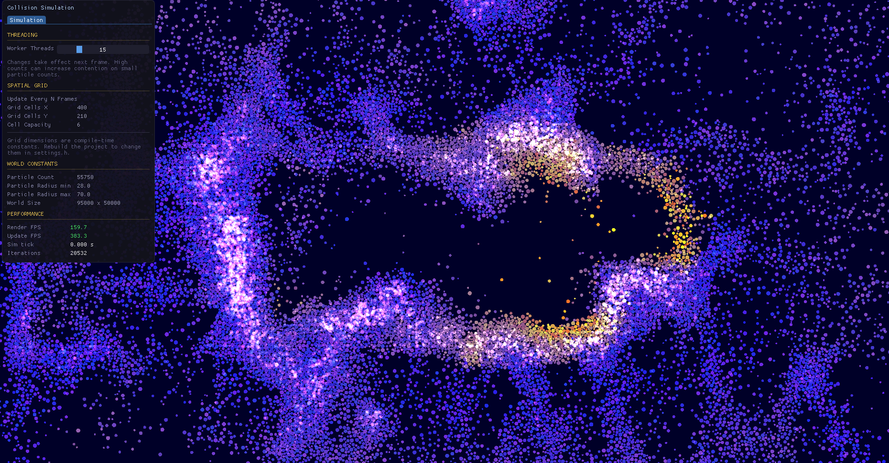
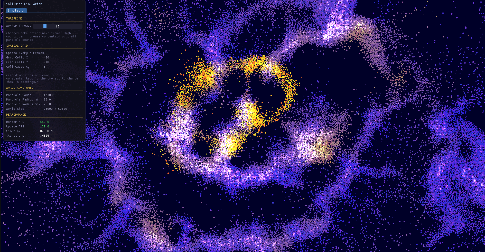
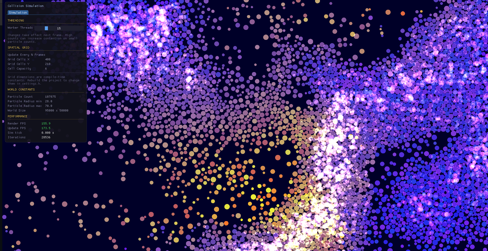

# Verlette Integration Collision Resolution Sim
## Description
This is an optimized collision detection and resolution simulation, it uses a spatial grid to detect collision pairs and then verlette integration
to resolve the collisions accuratly, accounting for physical overlap between the circles as well as velocity adjustments.

## Images

# Youtube Link
