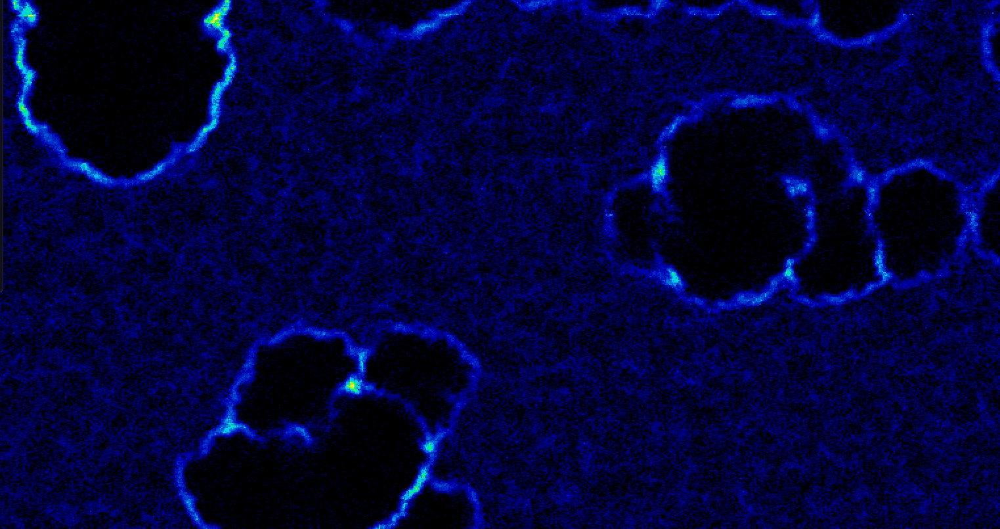
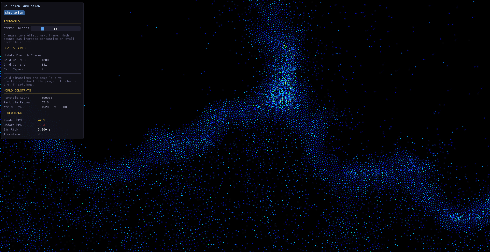
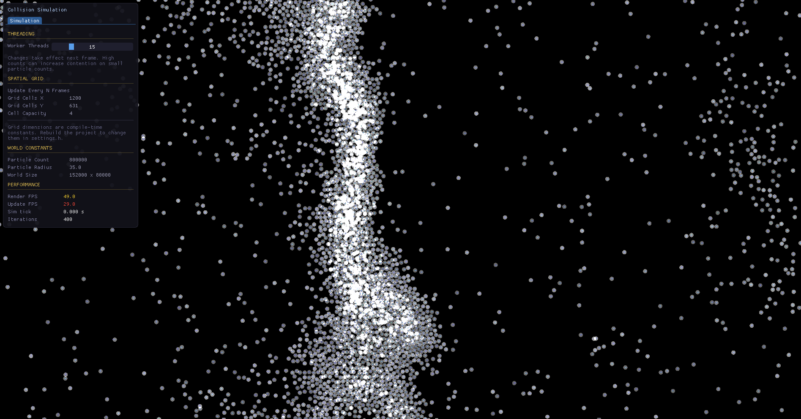

# Verlette Integration Collision Resolution Sim
## Description
This is an optimized collision detection and resolution simulation, it uses a spatial grid to detect collision pairs and then verlette integration
to resolve the collisions accuratly, accounting for physical overlap between the circles as well as velocity adjustments.

## Images

# Youtube Link
<iframe width="560" height="315" src="https://www.youtube.com/embed/opUkOhR4IGk?si=Jf4bSoeBDfMedL3q" title="YouTube video player" frameborder="0" allow="accelerometer; autoplay; clipboard-write; encrypted-media; gyroscope; picture-in-picture; web-share" referrerpolicy="strict-origin-when-cross-origin" allowfullscreen></iframe>